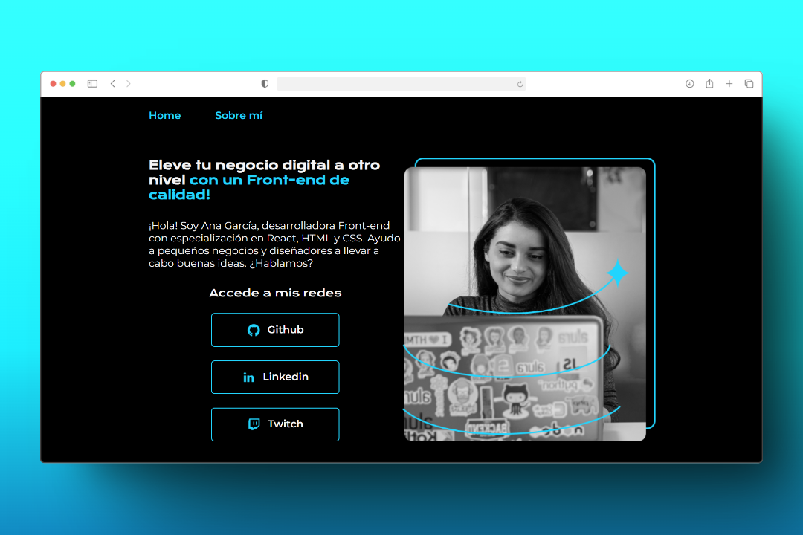

# Portfolio Personal - Diseño Responsive 🚀




## 📋 Descripción

Template de portafolio profesional diseñado para desarrolladores front-end. Este proyecto permite
mostrar de manera elegante las habilidades, proyectos y datos de contacto, con un diseño
completamente responsive que se adapta perfectamente a cualquier dispositivo.

## ✨ Características principales

-   📱 **Diseño responsive completo**: Adaptación perfecta desde móviles hasta pantallas de
    escritorio
-   🎨 **Estética moderna**: Combinación de colores y tipografías profesionales
-   🧩 **Estructura modular**: Fácil de personalizar y adaptar a necesidades específicas
-   🔗 **Integración con redes sociales**: Enlaces directos a perfiles profesionales
-   📊 **Optimizado para SEO**: Estructura HTML semántica

## 🛠️ Tecnologías utilizadas

-   
    **HTML5**: Estructura semántica moderna
-    **CSS3**:
    Estilos avanzados
    -   `Variables CSS`: Sistema de colores y tipografías personalizables
    -   `Flexbox`: Layout flexible y adaptable
    -   `Media Queries`: Adaptación a diferentes tamaños de pantalla
-    **BEM**:
    Estructura de clases ordenada y mantenible
-    **Mobile First**:
    Enfoque de diseño desde dispositivos móviles

## 📚 Estructura del proyecto

```
📦 portafolio-personal
 ┣ 📂 assets                  # Imágenes y recursos
 ┃ ┣ 📜 demo-desktop.png      # Captura del proyecto
 ┃ ┣ 📜 github.png            # Icono de GitHub
 ┃ ┣ 📜 imagen.png            # Imagen de perfil
 ┃ ┣ 📜 linkedin.png          # Icono de LinkedIn
 ┃ ┗ 📜 twitch.png            # Icono de Twitch
 ┣ 📂 styles                  # Archivos CSS
 ┃ ┗ 📜 style.css             # Estilos principales
 ┣ 📜 about.html              # Página "Sobre mí"
 ┣ 📜 index.html              # Página principal
 ┗ 📜 README.md               # Documentación
```

## 🚀 Cómo utilizar este template

1. **Clona este repositorio**:

    ```bash
    git clone https://github.com/sandovaldavid/alura-portfolio-template.git
    ```

2. **Personaliza el contenido**:

    - Modifica el texto en index.html y about.html
    - Reemplaza las imágenes en la carpeta assets
    - Actualiza tus enlaces de redes sociales

3. **Adapta los estilos**:

    - Personaliza los colores en las variables CSS del archivo style.css
    - Ajusta las tipografías según tus preferencias
    - Modifica layouts específicos si es necesario

4. **Despliega tu sitio**:
    - Sube los archivos a GitHub Pages, Netlify, Vercel u otro servicio de hosting

## 📱 Responsive Design

El proyecto implementa un diseño completamente responsivo con dos breakpoints principales:

-   **Móviles** (<768px): Diseño optimizado para pantallas pequeñas
-   **Tablets** (<1200px): Adaptaciones para dispositivos medianos
-   **Desktop** (≥1200px): Experiencia completa para pantallas grandes

## 🌟 Funcionalidades destacadas

-   **Header navegable**: Menú intuitivo entre secciones
-   **Presentación profesional**: Sección destacada con información personal
-   **Enlaces a redes sociales**: Conexión directa con tus perfiles profesionales
-   **Sección "Sobre mí"**: Espacio para presentar tu historia y experiencia
-   **Footer informativo**: Con enlaces de contacto y atribución

## 🤝 Contribuciones

Las contribuciones son bienvenidas. Si tienes ideas para mejorar este template:

1. Haz fork del proyecto
2. Crea una nueva rama (`git checkout -b feature/amazing-feature`)
3. Realiza tus cambios
4. Haz commit (`git commit -m 'Add some amazing feature'`)
5. Push a la rama (`git push origin feature/amazing-feature`)
6. Abre un Pull Request

## 📃 Licencia

Este proyecto está disponible como código abierto bajo la licencia MIT.

## 📞 Contacto

David Sandoval - [@sandovaldavid](https://github.com/sandovaldavid)

---

⭐️ Este proyecto fue creado como parte del curso de HTML y CSS: Responsividad con Mobile First de
[Alura Latam](https://www.aluracursos.com/) ⭐️
